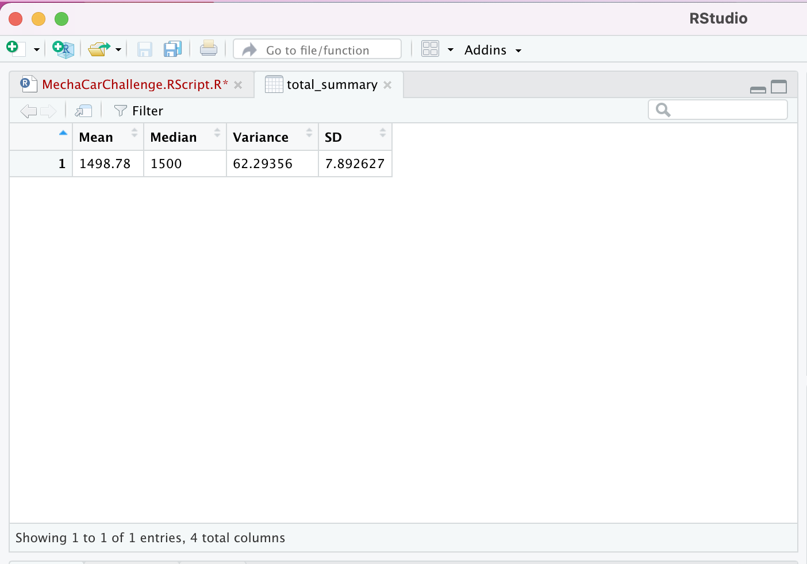
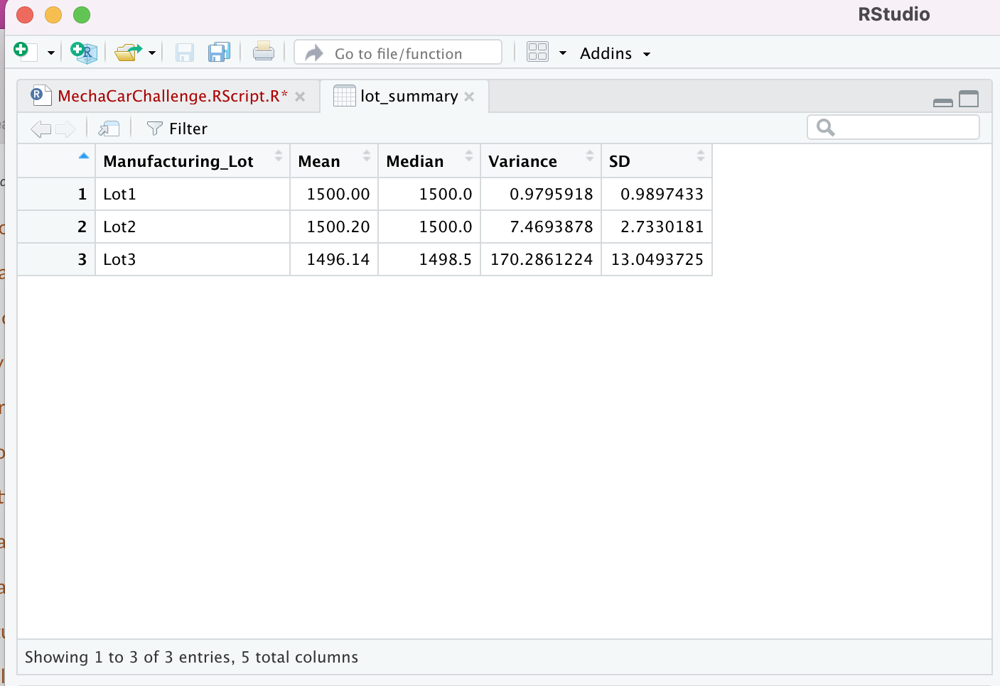

# MechaCar_Statistical_Analysis

## Purpose
#### The purpose of this analysis was to compare car preformance and sales.
##### One of the ways we tested preformance was a test on suspension coils. For MechaCar prototypes, the coils should not exceed 100 pounds per square inch. This is a summary of all the suspenstion coils which has a varience of about 62.3 which passes the requirment.

##### MechaCar is being produced from 3 different lots and the suspension coils were compared at the seperate lots. The chart below shows that the varience at all three lots is not only different, but lot 3 has a very wide varience which should be of concern.

##### This shows that there are production concerns that should be addressed so that it does not affect the quality or consistency.
